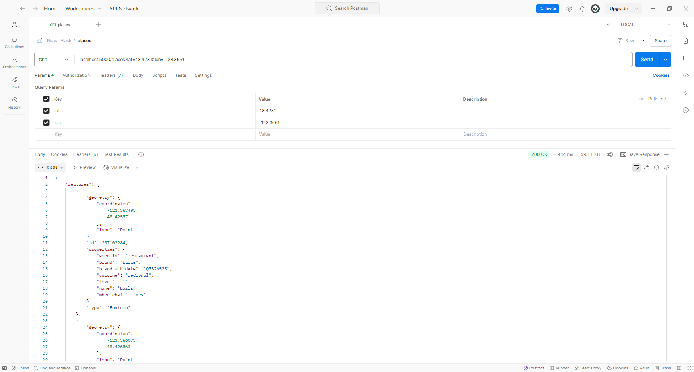

## Flask API

### Run Application

1. Clone the repository

```
        git clone https://github.com/asanchezr/react-flask-app

        cd api
```

2. Create python virtual environment

```
        python -m venv venv/
```

3. Activate Python Virtual Environment

Windows

```
        venv\Scripts\activate
```

Linux/Mac OS

```
        source venv/bin/activate
```

4. Install dependencies

```
        pip install -r requirements.txt
```

5. Run the server

```
        flask run
```

6. Use browser (or postman, curl) to call the API

```
        curl 'http://localhost:5000/places?lat=48.4231&lon=-123.3661'
```


